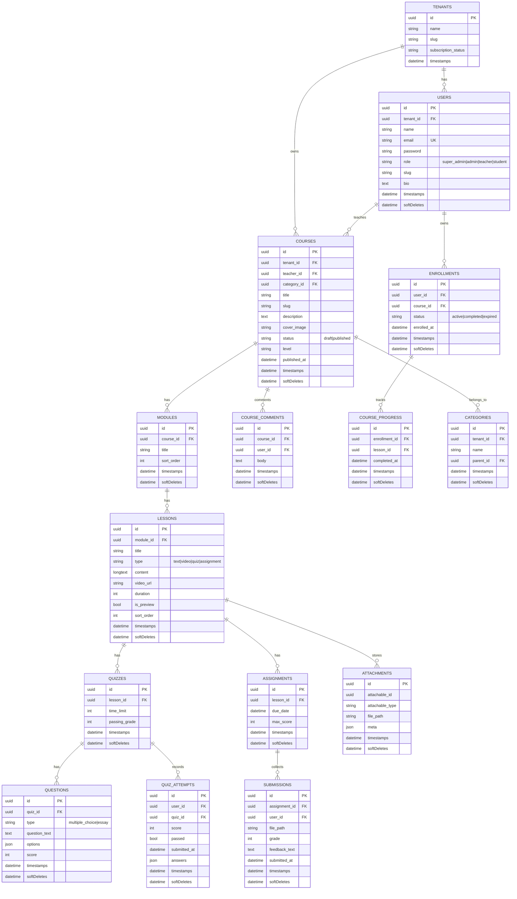

# eLearn LMS (Laravel 12 + Inertia React)

Platform LMS multi-tenant dengan peran Super Admin, Admin, Teacher, dan Student. Mendukung hierarki Course → Module → Lesson, quiz, assignment dengan submission, enrollment, pelacakan progres, katalog publik, serta tampilan publik bertema light/dark.

## 🚀 Mulai Cepat
```bash
git clone https://github.com/alifanLeywin/Laravel_eLearn_Ujikom.git
cd Laravel_eLearn_Ujikom

cp .env.example .env
composer install
npm install

php artisan key:generate
php artisan migrate --seed      # seed sample tenant/teacher/student/course
php artisan storage:link

npm run dev   # atau npm run build
php artisan serve
```
App jalan di http://localhost:8000

## 🛠️ Teknologi
- PHP 8.4, Laravel 12
- Inertia v2 + React 19 + TypeScript
- Tailwind CSS v4, Vite
- MySQL (default), PHPUnit 11
- Role: super_admin, admin, teacher, student

## 📊 ERD (lengkap)


## 🎭 UML Use Case (Peran & Fitur)
```mermaid
flowchart LR
    classDef actor fill:#fdf2f8,stroke:#fb7185,color:#9f1239,stroke-width:2px;
    classDef action fill:#fff7ed,stroke:#fb923c,color:#9a3412,stroke-dasharray: 3 3;

    SA((Super Admin)):::actor
    AD((Admin)):::actor
    TE((Teacher)):::actor
    ST((Student)):::actor
    GU((Guest)):::actor

    saTenant[Kelola tenant &amp; paket]:::action
    saStaff[Kelola admin &amp; teacher (staf)]:::action
    saCatalog[Kelola kategori &amp; tag katalog]:::action
    saModerate[Review/publish/trash/restore course]:::action
    adTeacher[Kelola teacher]:::action

    teCourse[Buat/edit/publish course sendiri]:::action
    teModule[Susun module &amp; lesson (text/video)]:::action
    teQuiz[Buat quiz, soal, time-limit, passing grade]:::action
    teAssignment[Buat assignment &amp; due date]:::action
    teAttachment[Kelola attachment materi]:::action
    teGrade[Nilai submission + feedback &amp; skor]:::action
    teAnalytics[Lihat progres &amp; analytics course]:::action

    stBrowse[Jelajah katalog, filter, cari course]:::action
    stEnroll[Enroll/unenroll course (role student)]:::action
    stPlayer[Player lesson: video/text, mark complete/undo]:::action
    stQuiz[Kerjakan quiz & lihat skor]:::action
    stSubmission[Upload assignment &amp; unduh feedback]:::action
    stProgress[Track progres &amp; achievement]:::action
    stComment[Komentar/pertanyaan course]:::action

    guBrowse[Lihat katalog publik &amp; detail course]:::action
    guAuth[Register/Login]:::action

    SA --> saTenant
    SA --> saStaff
    SA --> saCatalog
    SA --> saModerate

    AD --> saCatalog
    AD --> adTeacher
    AD --> saModerate

    TE --> teCourse
    TE --> teModule
    TE --> teQuiz
    TE --> teAssignment
    TE --> teAttachment
    TE --> teGrade
    TE --> teAnalytics

    ST --> stBrowse
    ST --> stEnroll
    ST --> stPlayer
    ST --> stQuiz
    ST --> stSubmission
    ST --> stProgress
    ST --> stComment

    GU --> guBrowse
    GU --> guAuth
```

## ✨ Fitur Utama
- Katalog publik & detail course bertema (dengan related courses)
- Student: enroll, player course (video/text/quiz/assignment), undo/complete lesson, unduh submission
- Teacher: penilaian submission, pembuatan quiz/soal, snapshot analytics, progress siswa
- Admin/Super Admin: kelola tenant, teacher, kategori, course; trash/restore course
- Halaman 403/404 kustom, navigasi sesuai role, toggle tema light/dark

## 👤 Akun Default (Seeder)
- Super Admin: `superadmin@example.com` / `password`
- Admin: `admin@example.com` / `password`
- Teacher: `teacher@example.com` / `password`
- Student: `student@example.com` / `password`

## 🔧 Perintah Umum
- Jalankan dev: `php artisan serve` + `npm run dev`
- Build aset: `npm run build`
- Format: `vendor/bin/pint --dirty`
- Seed data: `php artisan db:seed`
- Contoh tes: `php artisan test --filter=StudentCourseTest`

## 🗒️ Catatan
- Semua course gratis (kolom harga dihilangkan)
- Upload file di `storage/app/public` (jalankan `php artisan storage:link`)
- Enrollment hanya untuk student; role lain akan mendapat 403 kustom

## 📄 Lisensi
MIT
