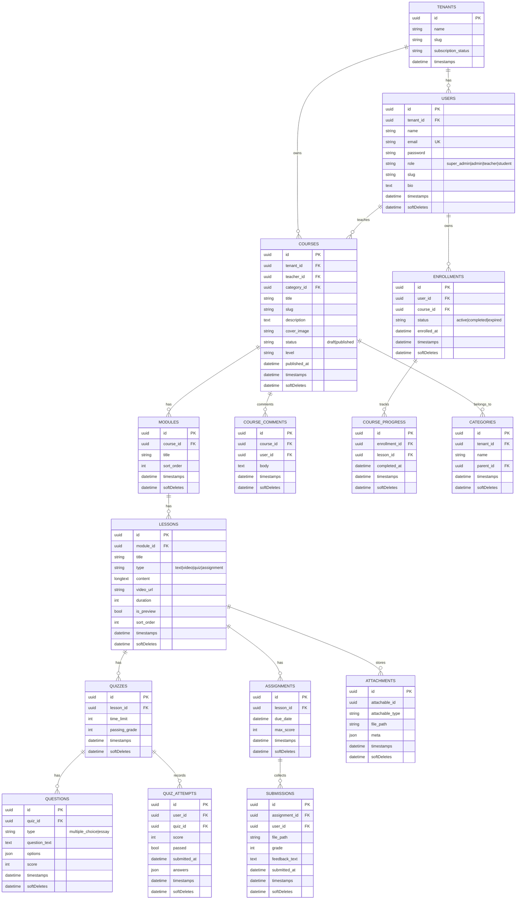

# eLearn LMS (Laravel 12 + Inertia React)

Multi-tenant LMS with roles for Super Admin, Admin, Teacher, and Student. Supports course hierarchy (Course → Module → Lesson), quizzes, assignments with submissions, enrollments, progress tracking, public catalog, and themed public pages..

## 🚀 Getting Started
```bash
git clone https://github.com/alifanLeywin/Laravel_eLearn_Ujikom.git
cd Laravel_eLearn_Ujikom

cp .env.example .env
composer install
npm install

php artisan key:generate
php artisan migrate --seed      # seeds sample tenants/courses/teachers/students
php artisan storage:link

npm run dev   # or npm run build
php artisan serve
```

App runs at http://localhost:8000

## 🛠 Tech Stack
- PHP 8.4, Laravel 12
- Inertia v2 + React 19 + TypeScript
- Tailwind CSS v4, Vite
- MySQL (default), PHPUnit 11
- Roles: super_admin, admin, teacher, student

## 📊 ERD (Complete)


## 🎭 UML Use Case (Role Responsibilities)
```mermaid
usecaseDiagram
    actor SA as "Super Admin"
    actor AD as "Admin"
    actor TE as "Teacher"
    actor ST as "Student"
    actor GU as "Guest"

    SA --> (Kelola tenant)
    SA --> (Kelola admin/teacher)
    SA --> (Kelola kategori & course)

    AD --> (Kelola kategori)
    AD --> (Kelola teacher)
    AD --> (Kelola course)
    AD --> (Lihat analytics course)

    TE --> (Kelola course pribadi)
    TE --> (Kelola module & lesson)
    TE --> (Buat quiz & soal)
    TE --> (Buat assignment)
    TE --> (Nilai submission & feedback)
    TE --> (Lihat progress siswa)

    ST --> (Lihat katalog & course detail)
    ST --> (Enroll course)
    ST --> (Selesaikan lesson)
    ST --> (Kerjakan quiz)
    ST --> (Upload assignment)
    ST --> (Lihat nilai & feedback)
    ST --> (Komentar course)

    GU --> (Lihat katalog publik)
    GU --> (Register/Login)
```

## ✨ Highlights
- Public catalog & course detail with themed UI and related courses
- Student: enroll, course player (video/text/quiz/assignment), undo/complete lesson, submissions download
- Teacher: grading submissions, quiz authoring, analytics snapshot, student progress view
- Admin/Super Admin: manage tenants, teachers, categories, courses; trash/restore courses
- Custom 403/404, role-aware nav, dark/light theme toggle

## 🔧 Common Commands
- Dev server: `php artisan serve` + `npm run dev`
- Build assets: `npm run build`
- Lint/format: `vendor/bin/pint --dirty`
- Seed data: `php artisan db:seed`
- Tests (sample): `php artisan test --filter=StudentCourseTest`

## 🗒️ Notes
- Courses are free (no price column)
- File uploads in `storage/app/public` (run `php artisan storage:link`)
- Enrollment restricted to students; others get 403 with custom page

## 📄 License
MIT
