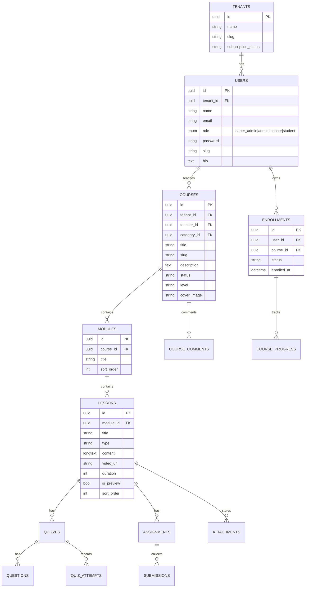
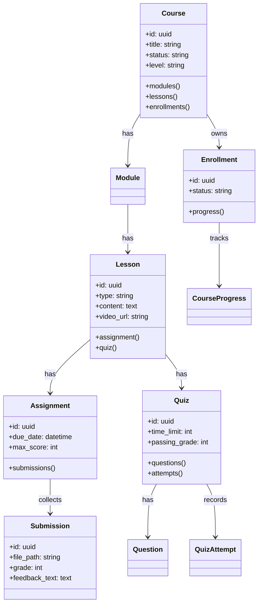

# eLearn LMS (Laravel + Inertia + React)

Multi-tenant learning management system with roles for Super Admin, Admin, Teacher, and Student. Supports course hierarchy (Course → Module → Lesson), assignments with file submissions, quizzes, enrollments, progress tracking, and public catalog pages styled for marketing use.

## Tech Stack
- PHP 8.4, Laravel 12 (Inertia SSR disabled, SPA style)
- Inertia v2 + React 19
- Tailwind CSS v4
- MySQL (default), Vite, TypeScript, PHPUnit 11

## Features (Highlight)
- Multi-tenant courses with categories, modules, lessons
- Enrollments (student-only), progress tracking, complete/undo complete
- Assignments (upload/download submissions), teacher grading & feedback
- Quizzes (MCQ/essay) with attempts, automatic scoring, pass check
- Public catalog + course detail pages with themed layouts and related courses
- Teacher dashboard (metrics, upcoming lessons), Student dashboard (summary & recommendations)
- Soft-delete courses with trash + restore/force delete
- Role-aware navigation and custom 403/404 pages

## Setup
```bash
cp .env.example .env

composer install
npm install

php artisan key:generate
php artisan migrate --seed   # seeds sample tenants/courses/teachers/students
php artisan storage:link

npm run build                # or npm run dev
php artisan serve
```

Visit: http://localhost:8000

## ERD (Simplified)


## UML (Key Classes/Relations)


## Key Pages (Inertia + React)
- Public: Home, Courses list, Course detail (enroll + related), Teachers list/detail
- Auth: Login/Register/Forgot/2FA
- Admin/Teacher: Courses (CRUD, modules/lessons, quiz & assignment management), Teachers (CRUD), Categories, Tenants (Super Admin)
- Student: Dashboard, Course player (video/text/quiz/assignment), progress toggle, assignment submit/download
- Errors: Custom 403/404 Inertia pages

## Notes
- Courses are free (price removed)
- Soft deletes enabled for courses with trash/restore/force delete
- File uploads stored in `storage/app/public` (run `storage:link`)
- Only students can enroll; teachers/admins blocked with custom 403

## Testing
```bash
php artisan test --filter=StudentCourseTest
```

## Commands (Common)
- Dev server: `php artisan serve` + `npm run dev`
- Lint/format: `vendor/bin/pint --dirty`
- Seed sample data: `php artisan db:seed`

## License
MIT
